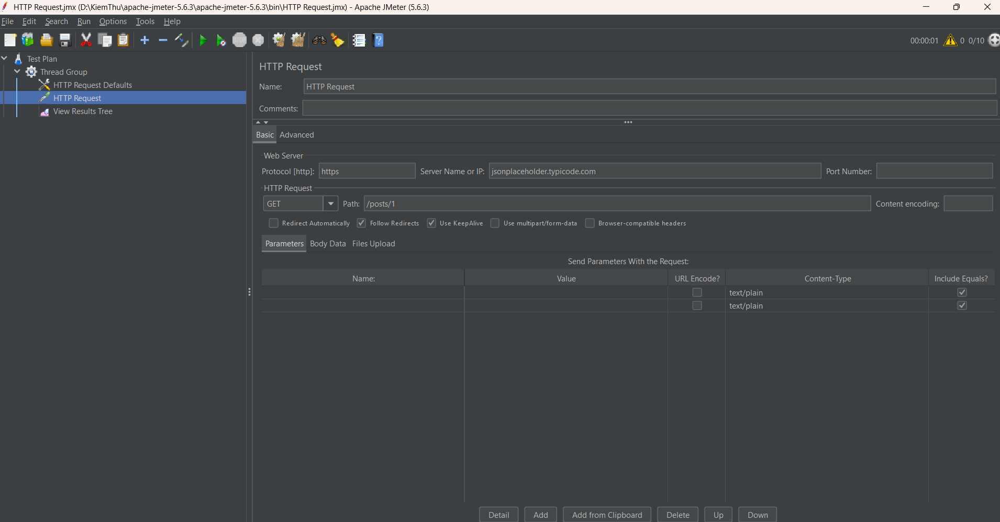
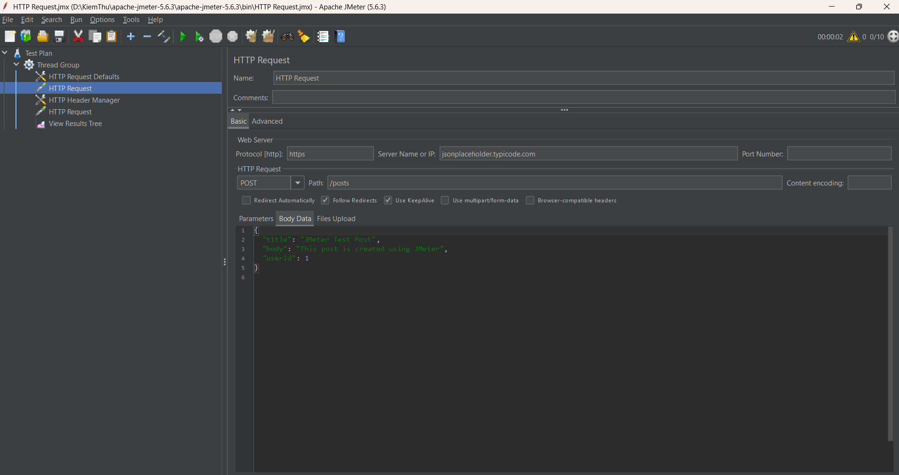
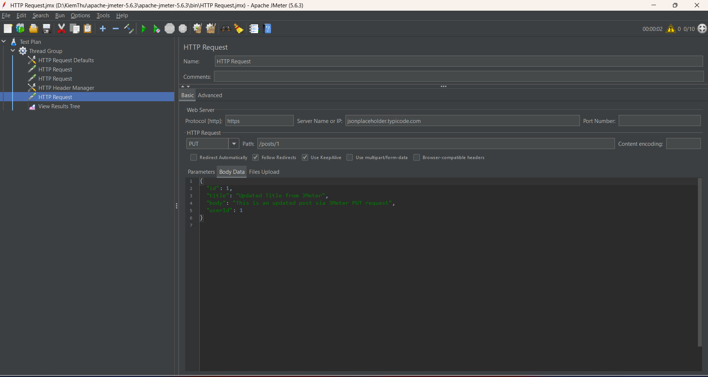
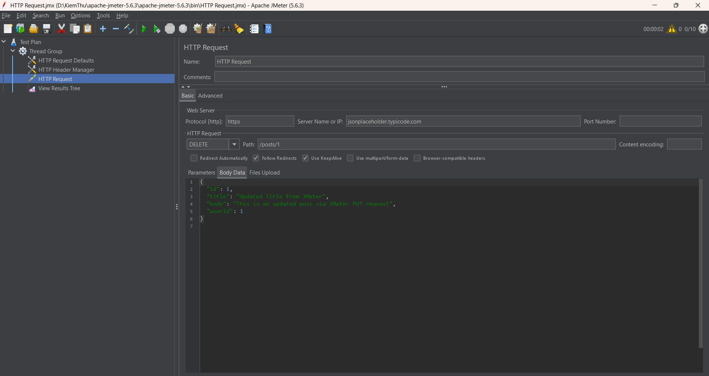

# 🧪 Bài Thực Hành Kiểm Thử API với JMeter

## 📌 Thông tin sinh viên:

- Họ tên: Nguyễn Danh Hiếu
- MSSV: 22010104
- Lớp: [Điền lớp]

---

## 🎯 Mục tiêu bài thực hành:

- Thực hiện kiểm thử các phương thức cơ bản trong API REST: **GET**, **POST**, **PUT**, **DELETE**
- Sử dụng công cụ **Apache JMeter**
- Làm quen với cách thiết lập Test Plan, gửi Request và kiểm tra Response
- Quan sát hiệu năng API qua các thông số như: Response Time, Status Code, Payload

---

## 🛠️ Công cụ sử dụng:

- **Apache JMeter** (Phiên bản: 5.x trở lên)
- **API mẫu:** [JSONPlaceholder](https://jsonplaceholder.typicode.com/)

---

## ✅ Chi tiết các API đã test:

| Method | Endpoint | Mô tả | Expected Status |
|---|---|---|---|
| GET | `/posts/1` | Lấy 1 bài post theo ID | 200 OK |
| POST | `/posts` | Thêm mới 1 bài post | 201 Created |
| PUT | `/posts/1` | Cập nhật 1 bài post | 200 OK |
| DELETE | `/posts/1` | Xóa 1 bài post | 200 OK hoặc 204 No Content |

---

## 🛠️ Cấu hình Thread Group:

| Thông số | Giá trị |
|---|---|
| Number of Threads (users) | 1 |
| Ramp-Up Period (seconds) | 1 |
| Loop Count | 1 |

*(Mục đích test từng request một, tránh gửi quá tải)*

---

## ✅ Cấu hình HTTP Header Manager (cho POST/PUT/DELETE):

| Header | Value |
|---|---|
| Content-Type | application/json |

---

## ✅ Nội dung Body Data cho từng request:

### POST Body:

```json
{
  "title": "JMeter Test Post",
  "body": "This post is created using JMeter",
  "userId": 1
}
```

---

### PUT Body:

```json
{
  "id": 1,
  "title": "Updated Title from JMeter",
  "body": "This is an updated post via JMeter PUT request",
  "userId": 1
}
```

---

### DELETE Body:

- **Không cần Body**

---

## ✅ Kết quả kiểm thử:

- **Tất cả các request gửi đi đều nhận phản hồi với status code đúng mong đợi (200 / 201 / 204)**
- Response Time dao động từ **200ms - 900ms** tùy API
- Nội dung Response đúng định dạng JSON
- Các API hoạt động ổn định khi chạy nhiều lần

---

## ✅ 📸 Kết quả minh họa (Screenshot):

### 1. GET Request - Status 200 OK:



---

### 2. POST Request - Status 201 Created:



---

### 3. PUT Request - Status 200 OK:



---

### 4. DELETE Request - Status 200 OK:



---

> 📌 **Ghi chú:**  
Ảnh chụp màn hình kết quả được lưu trong thư mục `/images` của repo này.

---

## ✅ Kết luận:

- Qua bài thực hành này, em đã hiểu cách sử dụng JMeter để test các loại request API REST.
- Biết cách cấu hình **Header**, **Body Data**, **Thread Group** và các **Listener**.
- Thực hành được các thao tác **GET**, **POST**, **PUT**, **DELETE** cơ bản trên môi trường giả lập.
- Bước đầu làm quen với kiểm thử hiệu năng API.

---

## ✅ Đường dẫn GitHub repo:

> [Dán link GitHub repo của bạn tại đây]

---

## ✅ File đính kèm trong repo:

- `/image/` (Thư mục chứa các ảnh chụp màn hình kết quả)
- `README.md` (Báo cáo này)

---

*✅ Kết thúc báo cáo ✅*
